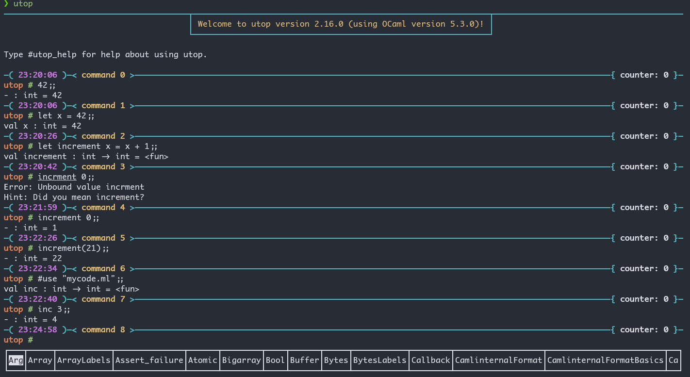
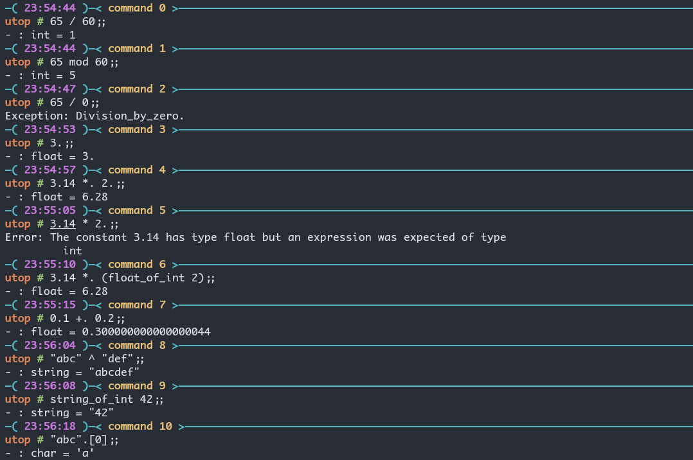
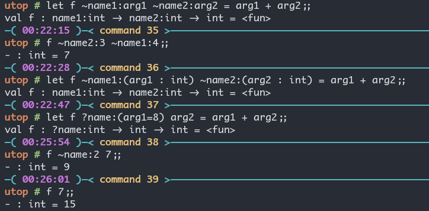
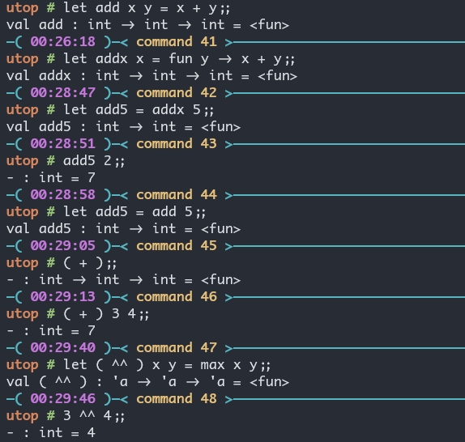
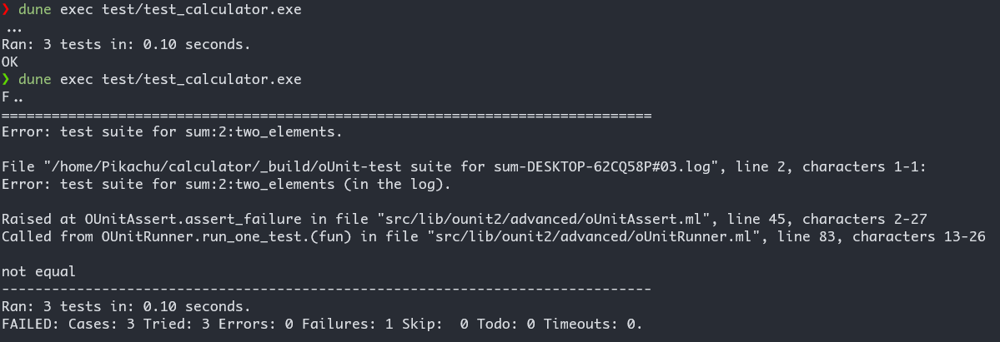
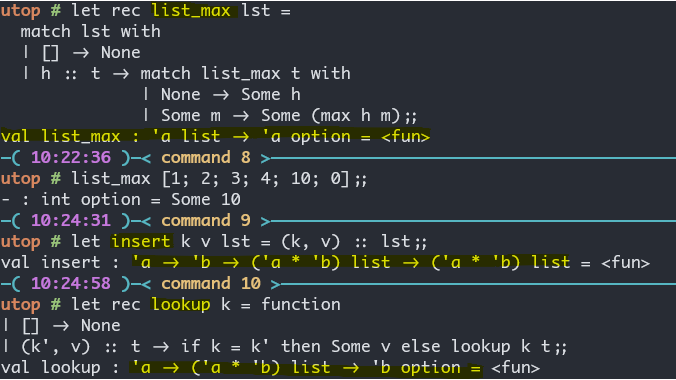
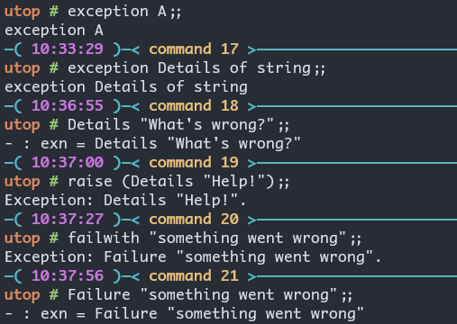

[OCaml Programming: Correct + Efficient + Beautiful — OCaml Programming: Correct + Efficient + Beautiful](https://cs3110.github.io/textbook/cover.html)

This book is the textbook for CS 3110 *Data Structures and Functional Programming* at **Cornell University**. 

现在我的 WSL2 里的环境如下:

- `opam --version`: `2.4.1`
- `opam switch list`: `4.14.1`(`ocaml-base-compiler = 4.14.1`), `default`(`ocaml-base-compiler = 5.3.0`)

使用下面的命令创建一个新的 Switch:
```bash
opam switch create cs3110-2025fa ocaml-base-compiler.5.3.0
eval $(opam env)
opam install -y utop odoc ounit2 qcheck bisect_ppx menhir ocaml-lsp-server ocamlformat
```

You should now be able to launch **utop**, the OCaml Universal Toplevel.
```bash
utop
```

## The Basics of Ocaml

### Toplevel

我现在安装了 utop.



The best workflow when using the toplevel with code stored in files is:

- Edit the code in the file.
- Load the code in the toplevel with `#use`.
- Interactively test the code.
- Exit the toplevel. **Warning:** do not skip this step. `#quit;;`

### Storing code in files

现在我们开始在文件里写一些代码:
- There is no double semicolon `;;` at the end of that line of code. The double semicolon is intended for *interactive sessions in the toplevel*, so that the toplevel knows you are done entering a piece of code. There’s usually no reason to write it in a `.ml` file.

```ocaml
(* hello.ml *)
let _ = print_endline "Hello world!"
```

```bash
mkdir hello-world
cd hello-world
ocamlc -o hello.byte hello.ml
./hello.byte # Hello world!
```

### Dune

#### 手工创建一个 Dune Project
- 创建一个名为 `dune` 的文件, 里面写上:
```
(executable
 (name hello))
```

- 创建一个名为 `dune-project` 的文件, 里面写上: `(lang dune 3.4)`
- `dune build hello.exe` 来构建
- 接下来在 `_build/default/hello.exe` 处就可以找到构建后的可执行文件
- 或者使用 `dune exec hello.exe` 来执行文件
- `dune clean` 来清理构建的文件

#### 自动创建一个 Dune Project

```bash
dune init project calculator
cd calculator
code .
dune exec bin/main.exe
```


在 VSCode 里显示如下:


可以和 `typst watch main.typ` 一样, 我们也有: `dune build --watch`.

### Ocaml 里的表达式

注意: 

- ocaml 里的 `*` 只能用作**整数**乘法, 浮点数必须为 `*.` (这后面有个**小数点**.)
- **字符串的 `^` 表示拼接**



`if` 表达式, `let ... in ...` 表达式, `assert` 表达式, 函数表达式.


**函数表达式**:

- 普通函数: `let f x = ...`
- 递归函数: `let rec f x = ...`
- Mutually Recursive Function: `let rec f x1 ... xn = e1 and g y1 ... ym = e2`
- 也可以把函数写成: `let f = fun x -> ...`

OCaml 提供一个 `|>` 的中缀运算符, 实现**管道 (Pipelines) 操作**:
```ocaml
square (inc 5);;
5 |> inc |> square;;
```


#### Polymorphic Functions
*identity function*: `let id x = x`; `val id : 'a -> 'a = <fun>`.

- `'a` 是一个类型变量

我们可以通过: 提供参数的类型, 提供函数的类型, 提供参数之间的运算 (这样来确定参数类型), 把多态函数确定下来.


#### Labeled and Optional Arguments
```ocaml
let f ~name1:arg1 ~name2:arg2 = arg1 + arg2;;
let f ~name1:name1 ~name2:name2 = name1 + name2;;
let f ~name1 ~name2 = name1 + name2;;
(* 后面两种是等价的, 标签名和参数变量名一样, 这种情况可以只写标签名. *)

let f ~name1:(arg1 : int) ~name2:(arg2 : int) = arg1 + arg2
let f ?name:(arg1=8) arg2 = arg1 + arg2
(* ?name代表的是可选参数, 你可以直接使用 f 7, 也可以 f ~name:2 7 *)
```



#### Partial Application
```ocaml
let add x y = x + y
let addx x = fun y -> x + y
let add5 = addx 5
add5 2
```

与此同时, `( + )` 也是一个函数, 我们甚至可以自己定义自己的中缀运算符: `let ( op ) ... = ...`



#### 尾递归 (Tail Recursion)
```ocaml
let rec count n =
  if n = 0 then 0 else 1 + count (n - 1)
  
let rec count_aux n acc =
  if n = 0 then acc else count_aux (n - 1) (acc + 1)

let count_tr n = count_aux n 0
```
> **A recursive call in tail position does not need a new stack frame. It can just reuse the existing stack frame.**
> 
> A good compiler (and the OCaml compiler is good this way) can notice when a recursive call is in _tail position_, which is a technical way of saying “there’s no more computation to be done after it returns”.

换言之, 返回后就不会有更多的计算了.

- `count` 在计算完 `count (n - 1)` 之后还需要计算一次 `1 + ...`;
- 而 `count_aux` 返回后不必进行计算了.

**The Recipe for Tail Recursion.** In a nutshell, here’s how we made a function be tail recursive:
1. Change the function into a helper function. Add an extra argument: the accumulator, often named `acc`.
2. Write a new “main” version of the function that calls the helper. It passes the original base case’s return value as the initial value of the accumulator.
3. Change the helper function to return the accumulator in the base case.
4. Change the helper function’s recursive case. It now needs to do the extra work on the accumulator argument, before the recursive call. This is the only step that requires much ingenuity.

```ocaml
(** [fact n] is [n] factorial. *)
let rec fact n =
  if n = 0 then 1 else n * fact (n - 1)
  
let rec fact_aux n acc =
  if n = 0 then acc else fact_aux (n - 1) (acc * n)
let fact_tr n = fact_aux n 1
```

但是这实际上会遇见 integer overflow. $\rightarrow$ `opam install zarith` (Ocaml 的大整数库)
```ocaml
#require "zarith.top";;
let rec zfact_aux n acc =
  if Z.equal n Z.zero then acc else zfact_aux (Z.pred n) (Z.mul acc n);;

let zfact_tr n = zfact_aux n Z.one;;

zfact_tr (Z.of_int 50)
```


### Documentation
```ocaml
(** [sum lst] is the sum of the elements of [lst]. *)
let rec sum lst = ...

(** Sum a list.
    @param lst The list to be summed.
    @return The sum of the list. *)
let rec sum lst = ...
```
### Printing

- 使用 `print_endline` 来打印, 多个打印可以使用分号的语法糖.
- 可以使用 `print_string`, `print_float`, `print_newline` 等
- 可以使用 `Printf.printf`: `%s` 代表 string, `%F` 代表 float.


### Debugging

- 使用 print
- `#trace` 很牛
- `ocamldebug`


### Exercises
Write an expression that computes `4.2` raised to the seventh power.
```ocaml
let rec ( ^^ ) x y = if y = 0 then 1. else x *. (( ^^ ) x (y - 1));;
(* val ( ^^ ) : float -> int -> float = <fun> *)
4.2 ^^ 7;;
(* - : float = 23053.9333248000075 *)
```

注意:  `x1 = x2` (Structural Equality) 比较内容相等 (比如两个引用, 可以物理位置不同但是内容相同); `x1 == x2`(Physical Equality) 表示必须物理上的完全一样.
- `"hi" = "hi"` 为 `true`, 而 `"hi" == "hi"` 为 `false`.
### OCaml operator cheatsheet
#### Built-in infix operators

| **Operator** | **Description**                                               |
| ------------ | ------------------------------------------------------------- |
| `=`          | Structural equality                                           |
| `<>`         | *Structural inequality*                                       |
| `<`          | Less than                                                     |
| `>`          | Greater than                                                  |
| `<=`         | Less than or equal                                            |
| `>=`         | Greater than or equal                                         |
| `==`         | Physical equality (same object)                               |
| `!=`         | Physical inequality (not same object)                         |
| `&&`         | Boolean and                                                   |
| `\|\|`       | Boolean or                                                    |
| `\|>`        | Reverse function application (`x \|> f` is the same as `f x`) |
| `@@`         | Function application (`f @@ x` is the same as `f x`)          |
| `**`         | Float exponentiation                                          |
| `^`          | String concatenation                                          |
| `@`          | List concatenation                                            |
| `!`          | Get the value of a `ref`                                      |
| `:=`         | Set the value of a `ref`                                      |
| `^^`         | Format string concatenation                                   |

## Datas and Types
### Lists

- `[]: 'a list` (**注意到: list 是放在类型后面的.**)
- `e1 :: e2 :: e3 = e1 :: (e2 :: e3)`
- `[e1; e2; ...; en] = e1 :: e2 :: ... :: en :: []`

列表常见的语法:

- Pattern Matching with Lists
```ocaml
let rec sum lst =
  match lst with
  | [] -> 0
  | h :: t -> h + sum t

let rec length lst =
  match lst with
  | [] -> 0
  | h :: t -> 1 + length t

let rec append lst1 lst2 =
  match lst1 with
  | [] -> lst2
  | h :: t -> h :: append t lst2
```

### Variants
```ocaml
type day = Sun | Mon | Tue | Wed | Thu | Fri | Sat
let d = Tue
```
### Unit Testing with OUnit2

1. `dune init project calculator`
2. `lib` 文件夹下建立一个 `lib.ml`, 写入比如一个 `let rec sum lst = ...`
3. `test` 的 `dune` 文件里写入:
```dune
(test
 (name test_calculator)
 (libraries ounit2 calculator))
```

4. `test` 的 `test_calculator.ml` 文件里写入:
```ocaml
open OUnit2
open Calculator.Lib

let tests = "test suite for sum" >::: [
  "empty" >:: (fun _ -> assert_equal 0 (sum []));
  "singleton" >:: (fun _ -> assert_equal 1 (sum [1]));
  "two_elements" >:: (fun _ -> assert_equal 3 (sum [1; 2]));
]
  
let _ = run_test_tt_main tests
```

5. `dune exec test/test_calculator.exe`



这里的 `>::` 和 `>:::` 都是 `Ounit2` 自定义的运算符.

### Records and Tuples
```ocaml
type ptype = TNormal | TFire | TWater
type mon = {name : string; hp : int; ptype : ptype}
{name = "Charmander"; hp = 39; ptype = TFire}
```


### Type Synonyms

```ocaml
type point = float * float
type vector = float list
type matrix = float list list
```

### Options
- `t option` is a type for every type `t`.
```ocaml
let rec list_max lst =
  match lst with
  | [] -> None
  | h :: t -> match list_max t with
              | None -> Some h
              | Some m -> Some (max h m);;
(* val list_max : 'a list -> 'a option = <fun> *)
list_max [1; 2; 3; 4; 10; 0];;
(* - : int option = Some 10 *)
```



### Algebraic Data Types

```ocaml
type point = float * float
type shape =
  | Point of point
  | Circle of point * float (* center and radius *)
  | Rect of point * point (* lower-left and upper-right corners *)
let area sh =
  match sh with
  | Point _ -> 0.0
  | Circle (_, r) -> Float.pi *. (r ** 2.0)
  | Rect ((x1, y1), (x2, y2)) ->
      let w = x2 -. x1 in
      let h = y2 -. y1 in
      w *. h

let center sh =
  match sh with
  | Point p -> p
  | Circle (p, _) -> p
  | Rect ((x1, y1), (x2, y2)) -> ((x2 +. x1) /. 2.0, (y2 +. y1) /. 2.0)
```

还可以实现 Recursive Variants:
```ocaml
type intlist = Nil | Cons of int * intlist
type 'a mylist = Nil | Cons of 'a * 'a mylist

let lst3 = Cons (3, Nil)  (* similar to [3] *)
let lst_hi = Cons ("hi", Nil)  (* similar to ["hi"] *)
```

### Exceptions

```ocmal
exception E of t
```



## Higher-Order Functions

```ocaml
let rec map f = function
  | [] -> []
  | h :: t -> f h :: map f t

let p x = print_int x; print_newline(); x + 1

let rec map f = function
  | [] -> []
  | h :: t -> let h' = f h in h' :: map f t

let lst2 = map p [1; 2]
```

比较两种实现:

- 第一种实现 evaluates to: `p 1 :: (p 2 :: [])`, 那么 `p 2` 会先被调用, 然后是 `p 1`. 打印的顺序是 `2` 然后是 `1`.
- 第二种实现 evaluates to: `let h' = p 1 in h' :: (let h' = p 2 in h' :: [])`, 那么 `p 1` 会先被调用, 然后是 `p 2`. 打印的顺序是 `1` 然后是 `2`.

```ocaml
let rec map_tr_aux f acc = function
  | [] -> acc
  | h :: t -> map_tr_aux f (f h :: acc) t

let map_tr f = map_tr_aux f []

let lst = map_tr (fun x -> x + 1) [1; 2; 3]
```

Filter and Tail Recursion:
```ocaml
let rec filter_aux p acc = function
  | [] -> acc
  | h :: t -> if p h then filter_aux p (h :: acc) t else filter_aux p acc t

let filter p = filter_aux p []

let lst = filter even [1; 2; 3; 4]
```
Fold left and Fold right:
```ocaml
val fold_left : ('acc -> 'a -> 'acc) -> 'acc -> 'a list -> 'acc
fold_left f init [b1; ...; bn] is f (... (f (f init b1) b2) ...) bn

val fold_right : ('a -> 'acc -> 'acc) -> 'a list -> 'acc -> 'acc
fold_right f [a1; ...; an] init is f a1 (f a2 (... (f an init) ...))
```

## Modular Programming

A *structure* is simply a collection of definitions, such as:
```ocaml
struct
  let inc x = x + 1
  type primary_color = Red | Green | Blue
  exception Oops
end
```

```ocaml
module MyModule = struct
  let inc x = x + 1
  type primary_color = Red | Green | Blue
  exception Oops
end
```

会产生下面的结果:
```
module MyModule :
  sig
    val inc : int -> int
    type primary_color = Red | Green | Blue
    exception Oops
  end
```

关于一个 module 的类型, 我们称之为一个 *module type* (或者 *signature*):
```ocaml
module type LIST_STACK = sig
  exception Empty
  val empty : 'a list
  val is_empty : 'a list -> bool
  val push : 'a -> 'a list -> 'a list
  val peek : 'a list -> 'a
  val pop : 'a list -> 'a list
end
```

```ocaml
module type MATH = sig
  (** [fact n] is [n!]. *)
  val fact : int -> int
end

module Math : MATH = struct
  (** [fact_aux n acc] is [n! * acc]. *)
  let rec fact_aux n acc =
    if n = 0 then acc else fact_aux (n - 1) (n * acc)

  let fact n = fact_aux n 1
end

(* Math.fact_aux 就无法访问, 从而 module type 提供了一个隐藏实现细节的功能 *)
```

Fucntors, 把 module 作为参数传递给另一个 module:
```ocaml
module type STACK = sig
  exception Empty
  type 'a stack
  val empty : 'a stack
  val is_empty : 'a stack -> bool
  val push : 'a -> 'a stack -> 'a stack
  val peek : 'a stack -> 'a
  val pop : 'a stack -> 'a stack
end

module ListStack : STACK = struct
  exception Empty
  type 'a stack = 'a list
  let empty = []
  let is_empty s = (s = [])
  let push x s = x :: s
  let peek s =
    match s with
    | [] -> raise Empty
    | h :: _ -> h
  let pop s =
    match s with
    | [] -> raise Empty
    | _ :: t -> t
end

module VariantStack = struct
  type 'a t = E | S of 'a * 'a t
  let empty = E
  let push x s = S (x, s)
  let peek = function E -> raise Empty | S (x, _) -> x
  let pop = function E -> raise Empty | S (_, s) -> s
end

(* Functor 的用处: 为不同的实现写同样的代码 *)
module StackTester (S : Stack) = struct
  let tests = [
    "peek (push x empty) = x" >:: fun _ ->
      assert_equal 1 S.(empty |> push 1 |> peek)
  ]
end

module ListStackTester = StackTester (ListStack)
module VariantStackTester = StackTester (VariantStack)

let all_tests = List.flatten [
  ListStackTester.tests;
  VariantStackTester.tests
]
```

