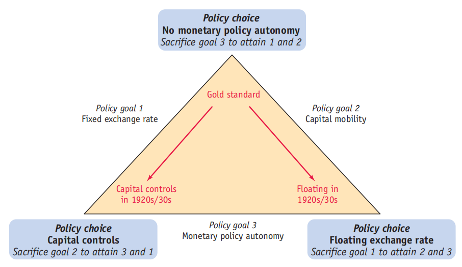
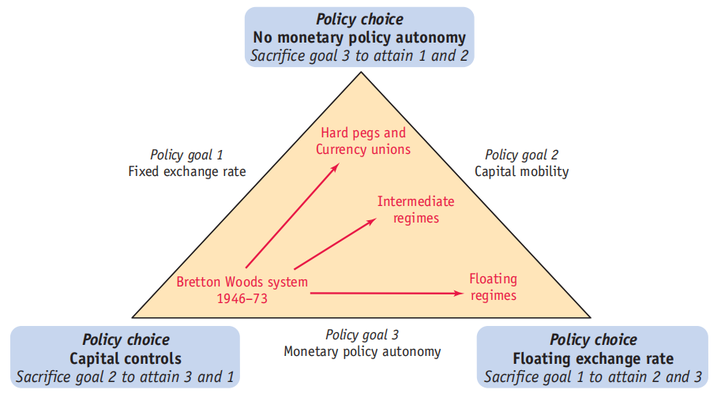
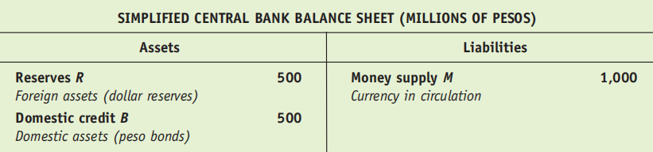
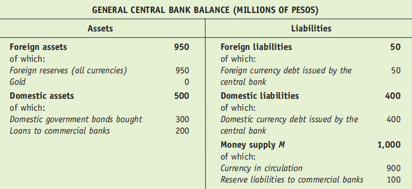
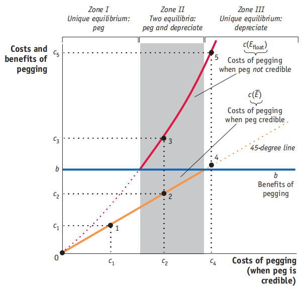
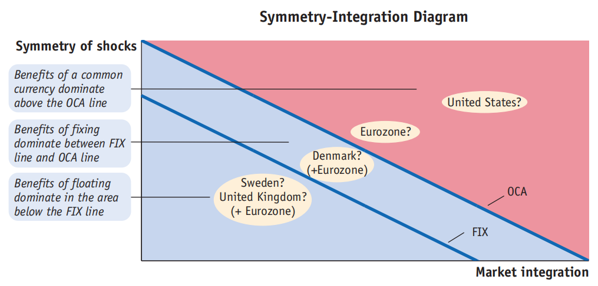
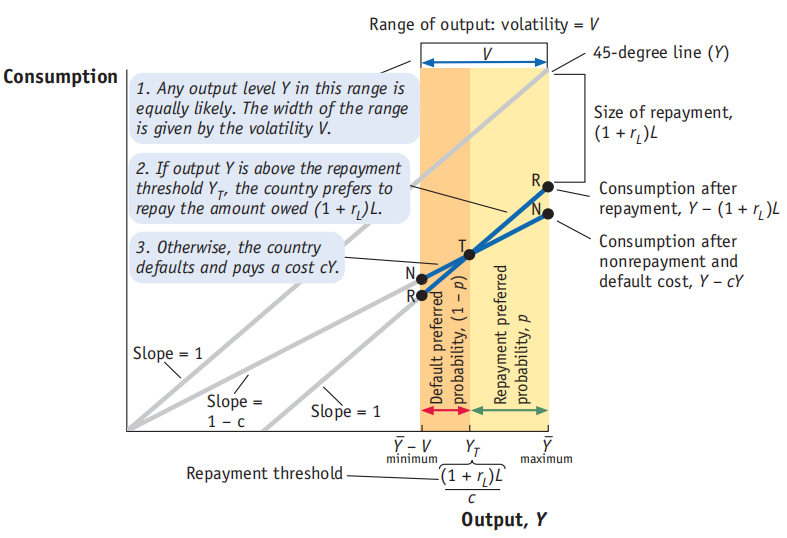

## 国际货币政策经验
### 金本位制
金本位制是1870年至1913年间逐渐成为主导的国际货币体系。

1. **核心原则**：该体系建立在**自由兑换**原则之上。各国中央银行承诺以固定的**铸币平价**随时买卖黄金以兑换纸币，并且黄金的进出口不受限制。
2. **运作机制**：各国将本国货币的价值与黄金挂钩（即固定每单位本国货币的黄金价格），而非直接与其他货币挂钩。这创造了一个**对称的系统**，没有单一的“中心国”。通过黄金套利，汇率被固定在由两国黄金价格之比决定的**平价汇率**附近小幅波动（即黄金输送点内）。
3. **自动调节**：体系通过**价格-铸币流动机制**自动纠正贸易失衡。例如，贸易顺差国将流入黄金，导致国内货币供应增加和物价上涨（通货膨胀），进而使实际汇率升值，最终减少贸易顺差。
4. **兴衰原因**：
    - **兴起（1914年前）**：全球化进程和技术发展促进了贸易一体化，采用固定汇率（金本位）的收益增加，且对丧失政策自主性（稳定成本）的政治关切有限。
    - **衰落（1920-1930年代）**：国家特定冲击增加、对货币政策自主性的追求增强等因素，导致各国为追求政策自主性而放弃了金本位制。

### 布雷顿森林体系
布雷顿森林体系是第二次世界大战后建立、从1946年运行至1973年的国际货币体系。

1. **核心设计**：该体系保留了**固定汇率**原则，但放弃了金本位下的资本自由流动。它通过实施**资本管制**来解决“三元悖论”。
2. **结构**：体系以**美元为中心**。其他成员国将本国货币与**美元**挂钩，维持固定汇率。而美元自身则按固定价格与**黄金**挂钩（每盎司35美元）。因此，美国成为体系的中心国家。
3. **目标与崩溃**：
    - 该体系旨在通过维持汇率稳定来鼓励战后贸易重建。
    - 到了1960年代，体系变得不可持续。主要原因包括：**资本流动性无法被有效遏制**；以及各国（尤其是越南战争时期美国通胀后）越来越不愿意将本国货币钉住美元。
    - 最终，主要发达国家转向了**浮动汇率制**（允许资本流动和货币政策自主性），而布雷顿森林体系在1973年正式终结。

**总结对比**：金本位制是一种以黄金为共同锚的对称性固定汇率体系，依赖自由兑换和资本自由流动。布雷顿森林体系则是一种以美元为锚的非对称性固定汇率体系，通过资本管制来维持汇率稳定，直至其因内外矛盾而解体。

## 固定汇率
### 一、固定汇率如何运作

固定汇率制度的核心是中央银行通过干预外汇市场，将本币与一种外币（如美元）或一篮子货币的汇率维持在一个固定的水平（即“钉住”）。

1. **中央银行的资产负债表操作**
    - 中央银行通过其资产负债表来管理汇率。其货币负债（货币供给 $M$）由两类资产支持：**国内信贷（$B$，如持有的本国政府债券）** 和**外汇储备（$R$，如持有的美元资产）**。即：$M = B + R$。
    - 维持汇率稳定的关键在于**外汇储备**。当市场出现对本币的抛售压力时（即本币有贬值压力），央行会动用外汇储备买入本币，以支撑其价格；反之，当本币有升值压力时，央行会卖出本币、购入外汇以增加储备。
2. **维持钉住的机制**
    - **应对货币需求冲击**：如果本国货币需求下降（例如，由于产出下降或外国利率上升），为了维持固定汇率和利率平价（$i = i^*$），央行必须减少货币供给（$M$）。在**国内信贷（$B$）不变**的情况下，央行通过**出售外汇储备（$R$ 减少）** 来回笼本币，从而抵消货币需求的下滑，使货币市场在固定利率下出清。
    - **应对国内信贷扩张**：如果央行扩张国内信贷（$B$ 增加，例如为政府赤字融资），为了**防止货币供给（$M$）过度增加导致利率下降和本币贬值压力**，央行必须**同步出售等额的外汇储备（$R$ 减少）** 进行“冲销操作”，以保持 $M$ 不变。此时，货币供给的**构成**（$B$与 $R$ 的比例）发生变化，但**总量**不变。
    - **支持比率**：储备与货币供给的比率（$R/M$）是衡量钉住汇率韧性的关键指标。比率越高，央行应对冲击的能力越强。货币局制度（Currency Board）要求100%的储备支持，被视为“硬钉住”。

$M = (\text{Foreign Assets}-\text{Foreign Liabilities})+(\text{Domestic Assets}-\text{Domestic Liabilities})$

### **二、固定汇率如何失败（汇率危机）**

当上述维持机制无法持续时，固定汇率制度就会崩溃，通常伴随本币的大幅贬值。文档主要阐述了两种经典的危机模型：

1. **第一代危机模型：不一致的财政政策（Inconsistent fiscal policies, 基本面危机）**
    - **根源**：政府持续通过中央银行货币化其财政赤字（即不断扩张国内信贷 $B$），同时承诺维持固定汇率。
    - **过程**：为对冲国内信贷扩张以维持货币总量不变，外汇储备（$R$）会持续流失。即使初始储备充足，这种**不一致的政策组合**（扩张性财政/货币政策 + 固定汇率）最终也会导致储备耗尽。
    - **崩溃时点**：
        - **投资者缺乏远见**：储备会逐渐耗尽至零，届时央行无力干预，汇率被迫浮动并立即大幅贬值。
          在 $t=4$ 的时刻，此时通货膨胀一下子变为 $\mu$（国内信贷的增长率），那么：$i = r^* + \pi = r^*+\mu$，一下子跃变。
          同时，$M/P=L(i)Y$，那么 $P$ 必须立刻变大。
          
          
        
        - **投资者有远见（投机攻击）**：市场会预见到储备必将耗尽和未来的贬值。为了规避资本损失，投资者会提前发起**投机攻击**，一次性将本币兑换为央行的外汇储备。这会导致储备在耗尽前**突然、瞬间枯竭**，迫使汇率制度提前崩溃。崩溃发生时，汇率是平滑过渡的，没有跳跃式贬值。
          **发起投机性攻击的时刻：使得汇率平滑过渡的时刻。** 此时货币需求的下降恰好等于储备的流失量。$M^d = L(i)YP$，只要：$\Delta M^d = \Delta R = R_c$ 即可。

          

2. **第二代危机模型：不可信的承诺（contingent commitment, 自我实现的危机）**
    - **根源**：即使没有持续恶化的基本面（如财政赤字），政府的汇率承诺也可能是**有条件（或然）的**。当维持钉住的**成本**超过其**收益**时，政府可能会选择放弃。
    - **过程**：成本可能来自为维持高利率（例如为匹配锚货币国的紧缩政策）而导致的国内经济衰退（产出缺口）。如果市场参与者**预期**政府会因为成本过高而放弃钉住，他们就会要求更高的风险溢价（导致本国利率上升），这反过来会**进一步加大经济衰退和维持钉住的成本**，从而使放弃钉住的预期自我实现。
    - **关键点**：这种危机源于**多重均衡**和**预期的转变**。在“好”的均衡中，市场相信钉住会维持，成本低，政府也确实会维持；在“坏”的均衡中，市场怀疑钉住，导致成本升高，政府最终真的放弃了钉住。1992年英国因德国统一后利率上升而被迫退出欧洲汇率机制（ERM）就是一个典型案例。

      

**总结而言**，固定汇率通过央行动用外汇储备来对冲内外冲击以维持币值稳定。其失败要么源于**根本性的政策不一致**导致储备被消耗殆尽（第一代危机），要么源于**市场信心崩溃**引发的自我实现式投机攻击（第二代危机）。这两种机制都突显了在资本自由流动下，维持固定汇率对政策纪律和可信度的极高要求。

## 欧元
### 一、最优货币区（OCA）理论
该理论由罗伯特·蒙代尔提出，探讨形成一个共同货币区（如欧元区）在经济上是否最优。其核心标准包括：

1. **市场整合**：区域间贸易和资本流动程度高，使用共同货币可降低交易成本与不确定性。
2. **经济对称性**：成员国的经济周期相似，便于共同的货币政策应对冲击。
3. **劳动力流动性**：劳动力能自由跨区域流动，以应对非对称冲击带来的失业问题。
4. **财政联邦主义**：存在中央财政转移机制，可帮助受冲击地区进行调节。

文档指出，与美国相比，欧元区在**市场整合度、劳动力流动性和财政转移机制**方面较弱，因此许多经济学家认为欧元区并非一个理想的最优货币区。
### 二、欧洲中央银行（ECB）的主要特征

1. **核心目标**：高度专注于维持**价格稳定**（将通胀率控制在接近但低于2%）。
2. **强独立性**：在货币政策制定上具有高度的工具独立性和目标独立性，免受政治干预。
3. **禁止性规定**：不得为成员国政府财政赤字融资（禁止货币融资），原则上也不充当最后贷款人（此规定在后续危机中有调整）。
4. **决策机制**：由成员国央行行长及执行董事会成员通过共识决策，但透明度较低（不公布会议纪要）。

### 三、欧元区的形成与规则

1. **历史背景**：1992年《马斯特里赫特条约》确立了建立**经济与货币联盟（EMU）** 的目标，并于1999年由11个创始国率先启用欧元。
2. **准入条件（马斯特里赫特标准）**：欲加入欧元区的国家需满足：
    - **名义收敛**：汇率需在欧盟汇率机制（ERM）内保持稳定至少两年；通胀率和长期利率不得高于三个表现最佳成员国平均值过多（分别不超过1.5和2个百分点）。
    - **财政纪律**：政府赤字不超过GDP的3%；政府债务不超过GDP的60%。
3. **现状**：截至讲稿撰写时，欧元区已扩大至20个成员国。

### 四、固定汇率与货币联盟的区别

文档强调，加入货币联盟（如欧元区）比单纯的固定汇率制度（如丹麦加入ERM但保留克朗）要求更高、退出成本也更大。一旦加入欧元区，将**永久丧失独立的货币政策和汇率调整工具**。

### 五、欧元区的挑战与争议

1. **OCA标准的内生性**：有观点认为，加入货币联盟本身可能通过促进贸易一体化而事后满足OCA标准，但也可能因专业化加深而加剧经济不对称。
2. **政治动机**：一些国家（如东欧国家）加入欧元区可能出于政治、安全或战略考量，而非纯粹的经济合理性。
3. **危机暴露的结构缺陷**：2008年全球金融危机后，欧元区暴露出以下根本性弱点：
    - 缺乏真正的**财政联盟**和中央预算稳定机制。
    - 缺乏**银行业联盟**，银行监管和救助责任仍在成员国层面，容易形成“主权-银行恶性循环”。
    - ECB作为最后贷款人的角色最初受限，加剧了危机应对的难度。
    - 劳动力流动性不足，加剧了成员国间调整的困难。

**总结**：第17讲系统阐述了欧元区的经济理论基础（OCA）、核心机构（ECB）的设计与职权、历史形成过程以及其内在的结构性矛盾。它指出，尽管欧元区在平稳时期实现了低通胀目标，但其在**市场整合、劳动力流动、财政与银行业联盟**等方面的不足，使其在应对非对称经济冲击时面临严峻挑战，这些矛盾在2008年后的危机中充分显现。

## 宏观经济的问题

### 一、核心内容概述

本讲聚焦于解释两个长期存在的国际宏观经济学经验谜题：

1. **购买力平价（PPP）谜题**：为何现实中汇率并不总是等于两国价格水平之比（即绝对PPP不成立）？
2. **无抛补利率平价（UIP）谜题**：为何现实中高利率货币并未如理论预测那样发生贬值以抵消利差（即UIP不成立）？

### 二、对购买力平价（PPP）谜题的解释

文档从两个角度解释了长期汇率对PPP的偏离：

1. **套利限制（交易成本）**：
    - 由于运输成本、关税、监管壁垒等**交易成本**的存在，商品套利并非完全无摩擦。
    - 这导致实际汇率 $q = EP^*/P$ 可以在一个 **“无套利区间”** $\left[ \frac{1}{1+c}, 1+c \right]$ 内波动，而不会引发套利行为，其中 $c$ 为交易成本率。
    - 因此，PPP在长期也可能不成立，交易成本越高，偏离越大。

      

2. **非贸易品与巴拉萨-萨缪尔森效应**：
    - 经济体中存在**非贸易品**（如理发、住房服务），其价格无法通过国际套利均等化。
    - **巴拉萨-萨缪尔森模型**指出，贸易品部门的生产率增长会推高整体工资水平，进而抬升非贸易品的价格。
    - 因此，**生产率增长更快的国家，其整体价格水平会上升，导致实际汇率升值（$q$下降）**。这解释了为何富国（高生产率）的物价水平通常高于穷国，以及为何经济增长伴随本币实际升值。$A$ 是 productivity。
$$
\frac{\Delta q}{q} = n \times \left(\frac{\Delta A^*}{A^*}-\frac{\Delta A}{A}\right).
$$
### 三、对无抛补利率平价（UIP）谜题的解释

文档从风险和收益的角度进行解释：

1. **套利交易与风险**：
    - UIP谜题表现为：投资者借入低利率货币、投资高利率货币的**套利交易**，在现实中往往能获得持续的正收益，而非UIP预测的零收益。
    - 这揭示了外汇市场存在**套利限制**，主要原因是**风险**。汇率变动具有不可预测的波动性，可能侵蚀利差收益甚至造成亏损。
2. **夏普比率与风险调整后收益**：
    - 文档引入**夏普比率**（超额收益与标准差之比）来衡量风险调整后的回报。
    $$
    \text{Sharpe Ratio}=\frac{\mathbb{E}[R_A-R_F]}{\sigma_A}.
    $$
    - 实证表明，尽管套利交易可能提供正的平均超额收益，但其收益波动（风险）极大，导致其**夏普比率并不高**，甚至低于美国股票市场。
    - 因此，看似违背UIP的获利机会，实际上并未提供足够高的风险调整后回报来吸引无限套利，从而“谜题”在考虑风险后得以部分化解。
    - 文档也提及了“**比索问题**”，即对低概率大幅贬值事件的担忧，可能导致高利率持续存在。

### 四、关于市场效率的附带观点

在讨论UIP谜题的最后，文档引用了一段观点指出：**主动管理基金**的频繁交易活动有助于市场保持信息效率和价格发现功能，这使得普通投资者采取**被动指数化投资**（如将70%资金投入全市场指数基金，30%投入国际指数基金）成为一种合理且“寄生性”的明智选择。

**总结**：第18讲系统性地阐述了PPP和UIP两大经典理论在实证中失效的原因。PPP的偏离主要源于**实际摩擦**（交易成本）和**结构性差异**（非贸易品与生产率）；而UIP的偏离则主要源于**金融市场的风险**，使得套利行为受限，风险调整后的收益并不异常。最后，提到了主动投资与被动投资的关系。

## 宏观经济问题 II

### 一、主权债务与违约

1. **主权债务的特征与违约历史**：主权债务是一种或有债权（contingent claim），违约历史悠久（最早可追溯至公元前四世纪）。违约在新兴市场和发展中国家是反复出现的问题。
2. **违约的动机与成本**：
    - **违约收益**：国家可以停止偿还债务，保留资金。
    - **违约成本（惩罚）**：
        - **金融市场惩罚**：违约后一段时间内被排除在信贷市场之外，信用评级下调，风险溢价上升，且难以用本币借款。
        - **更广泛的宏观经济成本**：可能引发“双重危机”（违约与汇率危机）或“三重危机”（违约、汇率危机与银行危机），导致投资损失、贸易萎缩和经济衰退。数据显示，三重危机的平均成本高达GDP的21.7%，且持续时间更长。
3. **违约概率模型**：通过一个理论模型说明，当一国产出（$Y$）低于某个阈值（$Y_T$）时，政府会选择违约（因为违约后的消费 $(1-c)Y$ 高于还款后的消费 $Y - (1+r_L)L$）。违约概率随债务水平（$L$）和产出波动性（$V$）的增加而上升。贷款人则会根据违约风险提高贷款利率（$r_L$）以平衡预期收益。

   
   
	图中浅色的部分是还款的概率，深色的部分是违约的
4. **应用与案例**：
    - **新兴市场债务的回报**：从历史数据看（1970-2000年），新兴市场债务的事后（ex post）回报率（约9.1%）在考虑其高风险后，表现并不优于美国国债或公司债，表明贷款人仅能盈亏平衡。
    - **阿根廷危机（2001-02年）**：作为一个案例，说明了基本面恶化（如高额财政赤字、外部债务攀升、联系汇率制僵化）如何使经济体更容易发生自我实现的危机。

### 二、全球失衡与2007-09年全球金融危机

1. **危机背景：全球失衡**：
    - 危机前，新兴市场国家（EM）持续积累经常账户盈余（“储蓄过剩”），并将大量资本（以官方外汇储备形式）流向发达国家（DM），尤其是美国。
    - 这压低了全球利率，刺激了发达国家（特别是美国）的信贷过度扩张和资产价格泡沫。
2. **加剧危机的政策与扭曲**：
    - **发达国家过于宽松的货币政策**（如美联储长期维持低利率）。
    - **监管与监督的失败**：金融监管放松（如美国1999年废除《格拉斯-斯蒂格尔法案》），金融创新过度，导致“大而不能倒”的机构产生巨大风险。
    - **政府失灵**：对“大而不能倒”机构的隐性担保引发道德风险。
    - **市场失灵**：非理性投资者行为、羊群效应、信息不对称等。
3. **危机的爆发与传导**：
    - 美国房地产市场下滑和次级抵押贷款问题引发连锁反应，通过**金融加速器**机制（如财富效应、信贷紧缩）严重抑制了实体经济需求，导致“大衰退”。
    - 恐慌情绪推高了风险利差（如TED利差），并使美元作为避险资产升值。
4. **教训与政策启示**：
    - 需要将宏观经济结果与金融状况更紧密地联系起来。
    - **政策目标**应同时兼顾**价格稳定、就业和金融稳定**。
    - **利率政策**应与**宏观审慎政策**相结合，以维护金融体系稳定。

**总结**：第19讲深入探讨了国际宏观经济学中的两个重要现实问题：**主权违约的成因与高昂成本**，以及**全球金融危机的根源与深刻教训**。核心结论是，金融市场的惩罚和更广泛的经济危机风险是约束主权债务偿还的重要机制；而金融体系的脆弱性与宏观经济失衡的相互作用，是导致全球金融危机并使其影响深化的关键。

