# 面向对象技术引论

## 第一章 面向对象方法概论

### 1.1 基本思想

1. **对象**：客观存在的事物$\rightarrow$​对象，对象作为基本构成单位。
2. **属性与操作**：属性表示**性质**，操作表示**行为**。
3. **对象的封装**：对象的属性与操作结合为一体，成为一个独立的、不可分的实体，对外屏蔽其内部细节。公开静态的、不变的操作，而把动态的、易变的操作隐藏起来。  
4. **分类**：相同属性和相同操作分为一**类**。
5. **聚合**：复杂的对象可以用简单的对象作为其构成部分。  
6. **继承**：特殊类继承一般类。
7. **消息**：对象之间通过消息进行通讯，以实现对象之间的动态联系。  
8. **关联**：表示对象之间的**静态关系**。

### 1.2 什么是面向对象

从**程序设计方法的角度**看，面向对象是一种**程序设计范型**(paradigm)。使用**对象、类、继承、封装、聚合、关联、消息、多态性等**基本概念来进行程序设计。

从**软件方法学的角度**看，面向对象方法是一种运用对象、类、继承、封装、聚合、关联、消息、多态性等概念来构造系统的**软件开发方法**。

程序=<对象, 关系>  对象=算法+数据结构

## 第二章 需求获取与分析

需求工作：起始活动（可行性分析）$\rightarrow$ 需求获取活动（得到**软件需求陈述**，通过自然语言、用况图、用户故事等）$\rightarrow$ 需求分析活动（一个精确的需求模型）$\rightarrow$ 需求规约活动（**软件需求规约**，采用标准的模板） $\rightarrow$ 需求验证活动 $\rightarrow$ 需求管理活动

### 2.1 需求的定义

一个需求是一个陈述，描述了待开发产品／系统（或项）功能上的能力、性能参数或者其它性质。

### 2.2 需求的基本性质

IEEE标准830-1998要求单一需求必须具有5个基本性质:  

1. 必要的(Necessary)。缺少了这个需求是不是还可以？
2. 无歧义的(Unambiguous)。只能用一种方式解释吗？  
3. 可测试的(Testable)。可以对它进行测试吗？
4. 可跟踪的(Traceable)。可以从一个开发阶段到另一个阶段对它进行跟踪吗？不可能开发过程中需求就消失了。
5. 可测量的(Measurable)。可以对它进行测量吗？应该有一个方法可以衡量需求是否被满足了。

注:确定一个需求是否满足以上五个性质是复杂耗时的过程。

### 2.3 需求分类

**功能**；性能；外部接口；设计约束；质量属性  

功能的需求是最重要的，所有别的需求都必须依附在功能这个需求之上。

#### 功能需求

功能需求规约了系统或系统构件必须执行的功能。

1. 对该功能输入的假定，或者为了验证该功能输入，有关检测的假定。（类似于OI竞赛中给定的$n\leq 100$这样）
2. 功能内的任一次序，这一次序是与外部有关的。（应该先干啥）
3. 对异常条件的响应，包括所有内外部所产生的错误。
4. 需求的时序或优先程度。
5. 功能之间的互斥规则。
6. 系统内部状态的假定。
7. 为了该功能的执行，所需要的输入和输出次序。
8. 用于转换或内部计算所需要的公式。

#### 性能需求

系统或系统构件必须具有的性能特性。

注：**性能需求隐含了一些满足功能需求的设计方案**，经常对设计产生一些关键的影响。例如：排序，关于花费时间的规约将确定哪种算法是可行的。

#### 外部接口需求

应当为外部提供什么样的接口，应当使用哪些外部接口，进而必须可以处理这样的格式的数据。

1. 系统接口：与系统的其他应用进行交互。
2. 用户接口：规约对给用户所显示的数据，对用户所要求的数据以及用户如何控制该用户接口。
3. 硬件接口
4. 软件接口：和其他软件产品交互。比如和数据库管理系统交互，和操作系统交互。（问：和操作系统交互的接口到底是软件接口还是系统接口？）
5. 通讯接口：比如必须使用的网络类型。
6. 内存约束：描述易失性存储和永久性存储的特性和限制，特别应描述它们是否被用于与一个系统中其它处理的通讯。（问：为什么内存约束要被使用在外部接口需求这里？）
7. 操作：规约用户如何使系统进入正常和异常的运行以及在系统正常和异常运行下如何与系统进行交互。应该描述在用户组织中的操作模式，包括交互模式和非交互模式；描述每一模式的数据处理支持功能；描述有关系统备份、恢复和升级功能方面的需求。（问：没有理解）
8. 地点需求：如何安装以及调整一个地点，来适应新的系统。

#### 设计约束

**设计约束限制了系统或系统构件的设计方案。**就约束的本身而言，对其进行权衡或调整是相当困难的，甚至是不可能的。它们必须予以满足。

任取10秒，一个特定应用所消耗的可用计算能力平均不超过50%。（问：为什么不属于性能需求？）

系统必须用C++或其他面向对象语言编写。系统用户接口需要菜单。（问：这里为什么不属于外部接口需求？）

必须在对话窗口的中间显示错误警告，其中使用红色的、14点加粗Arial字体。（问：这里为什么不属于功能需求？）

1. 法规限制
2. 硬件限制
3. 与其他应用的接口
4. 并发操作
5. 审计功能
6. 控制功能
7. 高级语言需求
8. 握手协议
9. 应用的关键程序
10. 安全考虑

#### 质量属性

可靠性、可维护性、易用性（用户友好性）、安全性、可移植性、规模、速度

### 2.4 需求发现

#### 1. 自悟（Introspection）

需求人员把自己作为系统的最终用户，审视该系统并提出问题：“如果是我使用这一系统，则我需要…”

#### 2. 交谈

在交谈期间需求可能不断增长，或是以前没有认识到的合理需求的一种表现，说是“完美蠕行”(Creeping elegance)病症的体现，以至于很难予以控制，可能导致超出项目成本和进度的限制。

解决方法：项目管理人员和客户管理人员应该定期地对交谈过程的结果进行复审。

#### 3. 观察

尽管了解的这些信息可以通过交谈获取，但 “第一手材料”一般总是能够比较好地“符合现实”。

客户可能抵触这一观察。  

客户还可能认为开发者在签约之前，就已经熟悉了他们的业务。（问：这句话想表达什么？）

#### 4. 小组会

举行客户和开发人员的联席会议，与客户组织的一些代表共同开发需求。

#### 5. 提炼

**复审**技术文档。

提炼方法是针对已经有了部分需求文档的情况。依据产品的本来情况，可能有很多文档需要复审，以确定其中是否包含相关联的信息。在有的情况，也可能只有少数文档需要复审。

### 2.5 需求获取技术

#### 用况图（Use case diagram）

把系统看作一个**黑箱**，看它对外部的客观世界发挥什么作用，描述它外部可见的行为。

我们可以有很多参与者在这里面。

优势：易于探讨和理解、易于对需求规范化、有利于进行OOA、有助于发现主动对象、对系统测试来说，产生测试用例、有助于人机界面设计、etc

**系统边界、操作者、用况、关联、包含、扩展、泛化**  

##### 系统边界

某些事物可能既有一个对象作为其抽象描述，而本身（作为现实世界中的事物）又是在系统边界以外与系统进行交互的操作者。如超市中的收款员，他本身是现实中的人，作为操作者；在系统边界内，又有一个相应的“收款员”对象来模拟其行为或管理其信息，作为系统成分。

某些事物即使属于问题域，也与系统责任没有什么关系。如超市中的保安员，在现实中与超市有关系，但与所开发的系统超市商品管理系统无关系。这样的事物既不位于系统边界内，也不作为系统的操作者。

##### 操作者

尽管在模型中使用操作者，但操作者实际上并不是系统的一部分。它们存在于系统之外。

我们可能的操作者。

##### 用况（Use case）

从使用视角看：用况是对操作者使用系统的一项功能时所进行的交互过程的描述。

##### 关联

用况和操作者之间的唯一的关系，但是用况之间还有别的其他的关系。

##### 扩展（extend）

从基用况到扩展用况的扩展关系表明：按基用况中指定的扩展条件，把扩展用况的行为插入到由基用况中的扩展点定义的位置。

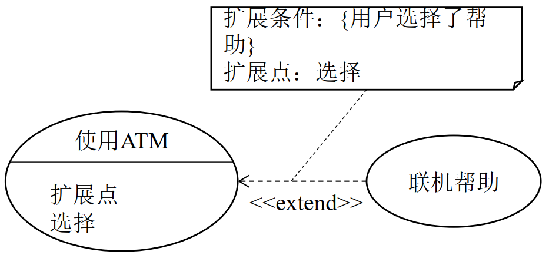

扩展的适用条件：(1) 异常情况；(2) 正常的变形描述时，而且希望采用更多的控制方式时，采用扩展。即在一个变化点上一个附加多个变体的场合下使用；(3) 用扩展关系来区分可实现系统的可配置部分（问：什么意思？）。

##### 包含

从基用况到供应者用况的包含关系表明：基用况在它内部说明的某一（些）位置上**显式地**使用供应者用况的行为的结果。

（问：包含和扩展有什么区别呢？我的理解是一个是显式地使用包含用况，一个是隐式地使用扩展用况？）

##### 泛化

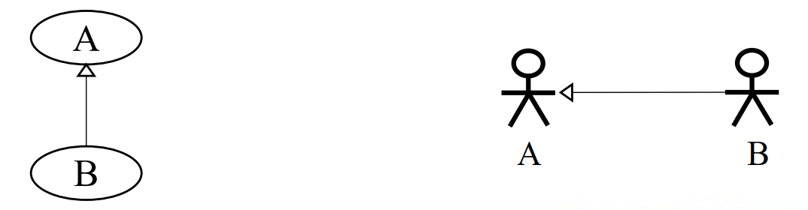

#### 构建用况图

识别操作者、捕获用况（从操作者的角度来看、从系统功能的角度来看、从场景技术的角度来看）、系统的需求建模、审查

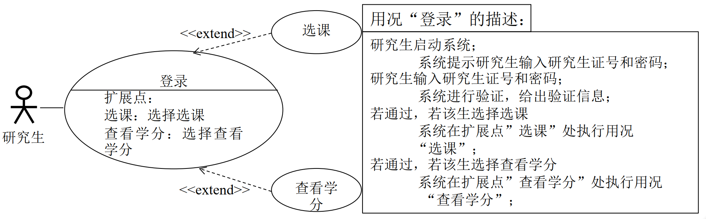

#### 用户故事

用户+事件。其中用户表现为对主要用户的描述，事件则是场景或系统/任务价值

用户故事相当于用况图正文的描述说明。UML实际推崇的是用况图，但在敏捷开发中使用面向对象方法时也会将用户故事作为系统的需求描述

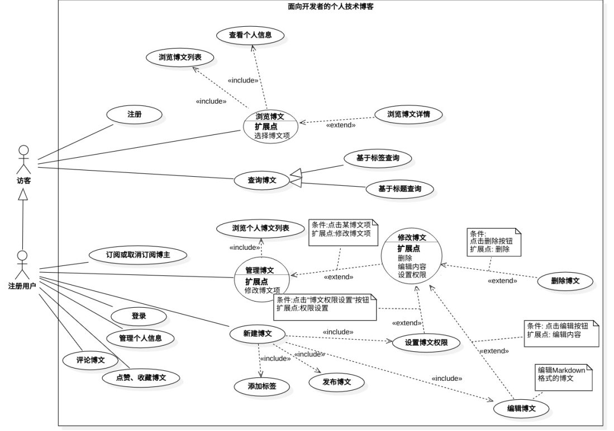

## 第三章 UML

UML是系统分析和设计的工具

### 3.1 表达客观事物的术语

#### 类与对象（数据抽象）

**参与者、信号、实用程序都是类。**

为什么对象没有操作栏？这是因为它的操作已经在它的类里面被定义了，而属性栏之所以存在是因为我们在构造这个对象的时候，必须为它填入初始的属性。

*抽象类*使用斜体字。

类可以有所在的包名。

**属性**的默认语法：`[可见性]属性名[:类型][多重性][=初始值][{特性串}]`，比如`+name: String[0..1] = "Hello"{readonly}`。

1. 可见性：**为什么引入可见性？**为了支持信息隐蔽这一软件设计原则。信息隐蔽是指在每个模块中所包含的信息（包括表达信息的数据以及表达信息处理的过程）不允许其它不需要这些信息的模块访问。信息隐蔽是实现模块**低耦合**的一种有效途径。
2. 属性名：小写字母开头
3. 类型名
4. 多重性：省略的时候默认为`[1..1]`
5. 初始值
6. 性质串：`a : integer = 10 {frozen}`，这就表示属性是不可改变的

所有的共同的属性，加上下划线，`defaultSize`这样子的。

| 可见性   | 符号表示 | 关键字表示  | 描述                            |
| -------- | -------- | ----------- | ------------------------------- |
| 公有的   | `+`      | `public`    | 所有其他的类/类目都可以使用     |
| 受保护的 | `#`      | `protected` | 仅其子类/类目才能使用           |
| 私有的   | `-`      | `private`   | 仅本类的操作才能使用            |
| 包内的   | `~`      | `package`   | 仅同一包中声名的类/类目才能使用 |

**操作**的默认语法：`[可见性] 操作名 [(参数表)] [: 返回类型] [{性质串}]`，例：`+ set(id : Integer, name : String) : Boolean {...}`。

参数表里的每个参数还可以如下：`[方向] 参数名 : 类型 [= 默认值]`，比如`in name: String = "Hello"`。

`in`输入参数，`inout`输入参数可修改，`out`输出参数。

衍型：类型的类型，用双尖括号包裹起来。`<<datatype>>`。

#### 接口（功能抽象）

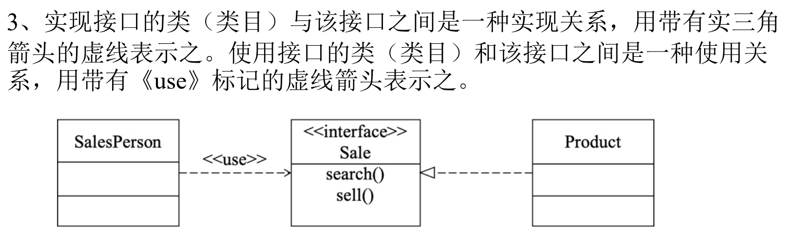

#### 协作（Collaboration，体现行为结构抽象）

协作是一个交互，涉及交互三要素：交互各方、交互方式以及交互内容 。

使机器人沿着一条路径移动所涉及的类  $\rightarrow$ 一个协作

#### 用况（功能抽象）

一个用况描述了系统的一个完整的功能需求。

**用况是通过协作予以细化的。**

#### 主动类（并发行为抽象）

**进程和线程都是主动类。**

主动类对象的行为通常与其他元素的行为是并发的。

至少具有一个进程或线程的类，能够启动系统的控制活动。

#### 构件

在遵循并提供了一组外部接口的实现的同时，隐藏内部实现。**构件是描述比特世界的软件制品的系统单位。**

**应用、文档、库、页和表都是构件。**

#### 制品

系统中包含物理信息的、可替代的物理部件。

这里说部件是“物理的”，指软件未运行时也存在的部分，主要指文件，如源代码、可执行程序、脚本等；软件系统中可能会存在不同类型的部署制品；制品通常代表对源代码/运行时信息的物理打包。

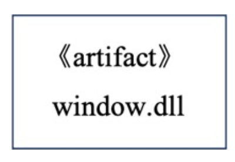

#### 节点

在运行时存在的物理元素，通常它表示一种具有记忆能力和处理能力的计算机资源（比如服务器、数据库管理系统等）

这里的“物理的”指实际机器设备；一个构件可以驻留在一个节点中，也可以从一个节点移到另一个节点。

### 3.2 表达关系的术语

#### 关联（association）

它指明一个类的对象与另一个类的对象间的联系。如果类的对象之间通过属性有连接关系，那么这些类之间的语义关系就是关联。**链是关联的实例**，是对象间的语义连接，是对象引用的元组（列表）。 在最常见的情况下，它是一对对象引用。

关联表示对象之间的**静态**联系。

这里的多重性是一个教师可以指导0到多个学生的论文，而一个学生只能被一个教师指导论文。

还可以用关联导航来解决。

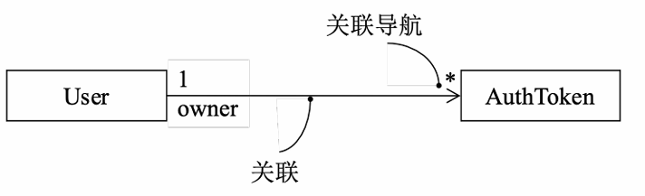

角色和关联端名：

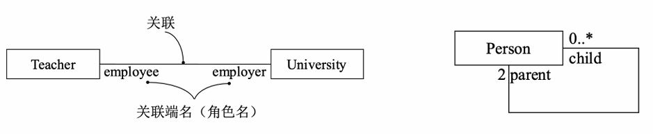

限定符：

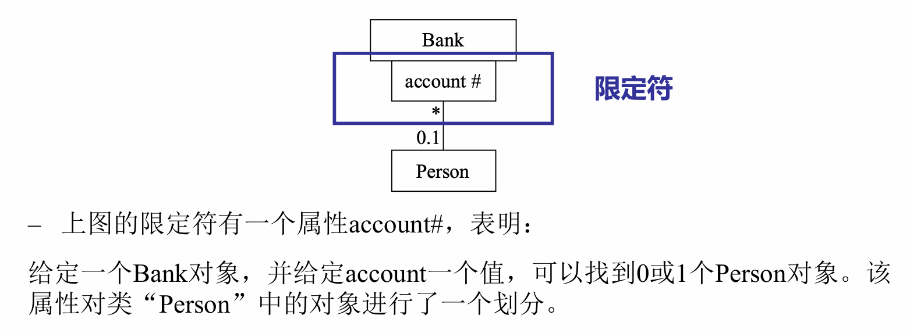

##### 聚合

**一种特殊形式的关联**，表达一种“整体 /部分”关系。即一个类表示了一个大的事物，它是由一些小的事物（部分）组成的。

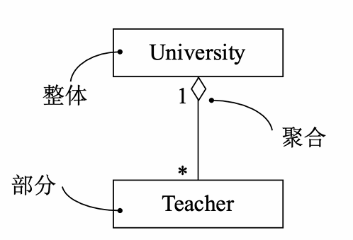

##### 组合

组合是一种特殊的聚合。组合中的对象具有相同的生命周期。

组合的末端的多重性不能超过1。因为一个对象最多组合成另一个对象。

在一个组合中，由一个链所连接的对象而构成的任何元组，必须都属 于同一个整体类的对象（问：没有理解这句话）

#### 关联类

关联类：具有关联和类特性的模型元素，可以被看作是关联，但还有类 的特性；或被看作是一个类，但有关联的特性。

比如我们能认为大学和教师之间的关联是通过任务来获得的。

#### 泛化（generalization）

“is-a-kind-of” 继承关系又称为一 般一特殊关系，在UML中把继承关系称为泛化关系。

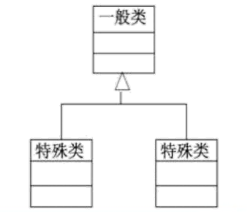

#### 实现（realization）

在两个地方会使用实现的关系：**接口与实现它们的类和构件之间；用况与实现它们的协作之间**。

#### 依赖（dependency）

依赖是一种使用关系，用于描述一个类目使用另一类目的信息和服务。

#### UML关系用法

##### 1. 结构关系

使用**“关联”**，模型化系统中存在的大量静态结构和动态结构。

以数据驱动：一个对象需要**导航**到另外一个对象

以行为驱动：一个对象需要与另一个对象**交互**

##### 2. 继承关系

使用**“泛化”**，对系统中存在的一般/特殊关系规约。

##### 3. 精化关系

使用**“实现”**，对系统中存在的精化关系规约

该术语用于表达不同抽象层之间的精化，体现“自顶向下，逐步求精” 的思想。如系统需求层的用况，可通过协作实现。这两者即可用 “实现”规约。

##### 4. 依赖关系

使用**“依赖”**，对不是结构、继承、精化的关系规约。

某类只作为另一类的**操作参数**，则可将它们之间的关系抽象为依赖

### 3.3 信息组织和解释的术语

#### 包

可以在小矩形里写包名，大矩形中表示内容。

也可以这样画：

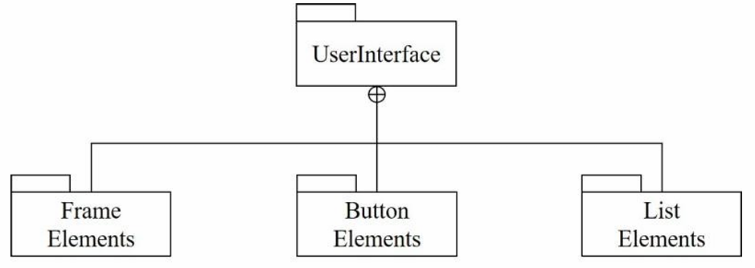

引入依赖和访问依赖。

这样表示`Controller`可以访问`Components`和`Subcomponents`。

#### 注解

注解可以是简单文字，也可以内嵌URL或文档链接，用**虚线**连接到所解释说明的模型元素上。

### 3.4 十四种图

#### 类图

类图显示了类（及其接口）、类的内部结构以及与其他类的联系。是面向对象分析与设计所得到的**最重要的模型**。

#### 对象图

用对象图说明在类图中所发现的事物的实例的数据结构和静态快照。

#### 构件图

就是用来表示构件之间的关系的图。

#### 包图

#### 部署图

#### 外扩图

外扩图是在UML2.5的基础上定义新建模元素的图，用以增加新的建模能力

#### 组合结构图

所以这个图可以和构件图结合在一起。

#### 用况图

#### 状态机图

通常都是对**反应型对象（reactive object）**的行为进行建模。

状态机图是描述一个对象或其他实体在其生命周期中所经历的各种状态以及状态变迁的图.

一个状态机图，规约了一个对象在其生存期内因**响应事件**所经历的状态序列以及对这些事件所作出的响应。

状态之间的转化是即时的。

延迟事件：延迟事件是指在当前状态下暂不处理，但将推迟到该对象的另一个状态下排队处理的事件。比如我现在想要识别出某一个事件，但是我现在不处理。`activity/defer`

**事件**：事件就是状态转移的实心线上面标记的东西。`activity(parameter1: Type1, ...)`。

1. 信号（Signal）事件：信号是一种Type，所以它的原类型是`signal`。这里是衍型。
2. 调用（Call）事件：一个调用事件表示对象接收到一个操作调用的请求。
3. 时间事件：时间事件后跟有计算时间量的表达式。`after (2 seconds)`。
4. 变化事件：指定条件变为真了，譬如`at (xxx)/selfTest(), when (altitude < 1000)`。

`activityName[(Parameter list)][Guard][/Action]`。比如：`right-mouse-down(location)[location in window]/object:=pick_object(location)`。

UML内置关键字：

1. `entry`：进入状态时首先执行该动作。它不能有参数或监护条件。
2. `exit`：在退出状态时最后执行该动作。它不能有参数或监护条件。
3. `do`：在状态的进入动作表达式（如果有）执行后，开始执行do活动，并且do活动可与其他的动作或者活动并行。

状态间的转移 vs. 状态内的转移 ： 如果源状态和目标状态都是自身，那么会先触发该状态的退出动作，再执行该状态的进入动作，和状态内的转移有区别。

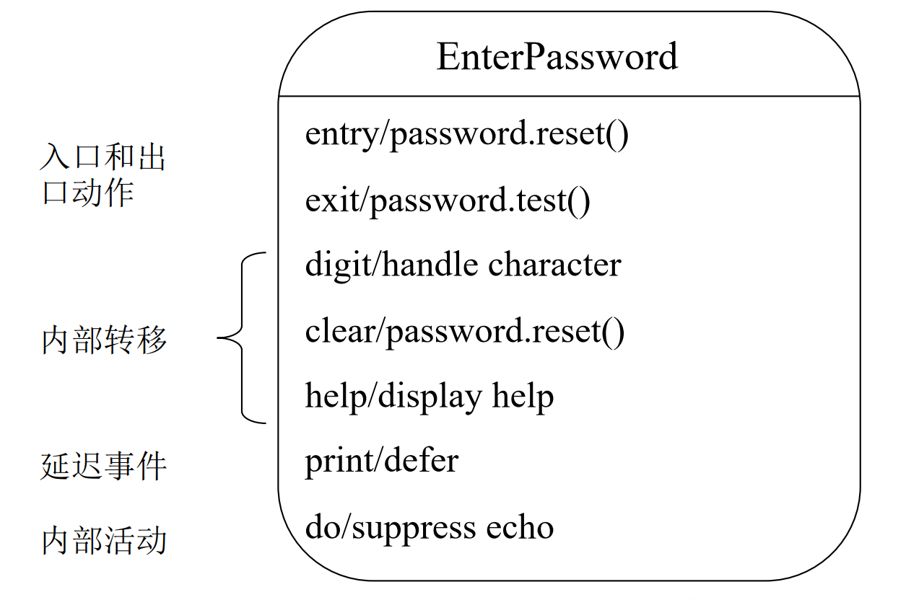

##### 组合状态

**顺序子状态机（非正交）和并发子状态机（正交）**

非正交状态机：最多有一个子初态和一个子终态。

1. 转移到该组合状态：这个被嵌套的子状态机一定有一个初态，以便在进入该组合状态并执行其进入动作后，将控制传送给这一初态。
2. 转移到该组合状态的一个子状态：在执行完**该组合状态的进入动作**（如有的话）和**该子状态的进入动作**后，将控制传送给这一子状态。

离开的时候：首先离开被嵌套的状态，即执行被嵌套状态的退出动作（如有的话）；然后离开该组合状态，即执行该组合状态的退出动作（如有的话）。

正交状态机：控制流分岔，分成了并发流。

#### 活动图

动作是原子的和即时的。

对象是方的矩形，而动作是圆角的矩形。

#### 顺序图

一种详细表示 对象之间以及对象与参与者实例之间交互的图，它由一组协作的对象（或参与者实例）以及它们之间可发送的消息组成，它强调消息之间的顺序。

对象：`[ObjectName]: ClassName`。

参与者：一个小人

对象生命线：一个垂直虚线，用X表示被析构。

执行规约：窄长的矩形。

消息：同步消息：实心的箭头，返回虚线箭头   异步消息：实现，空心的箭头

消息分支：把分支画成从一个点出发的多个箭头，每个箭头由监护条件标示

消息循环：`*Message[Guard]`，表示按照给定的表达式一直发送信息。

回调机制：申请对象在服务对象处事先登记所关心的事件，然后继续从事自己的工作；当服务对象监控到这样的事件发生时，再通知申请对象，由申请对象进行处理。这是一个异步的。

##### 结构控制

选择（`opt`,为真才执行）、条件（`alt`,有两种选择）、并发（`par`,同时做）、迭代（`loop guard`,循环）

#### 通信图

为表示一个消息的时间顺序，给消息加一个数字前缀（从1号消息开始），在控制流中，每个新的消息的顺序号单调增加（如2，3等等）。为了显示嵌套，可使用带小数点的号码（1表示第一个消息；1.1表示嵌套在消息1中的第一个消息；1.2表示嵌套在消息1中的第二个消息；等等）。

**通信图和顺序图两者语义上是等价的。**

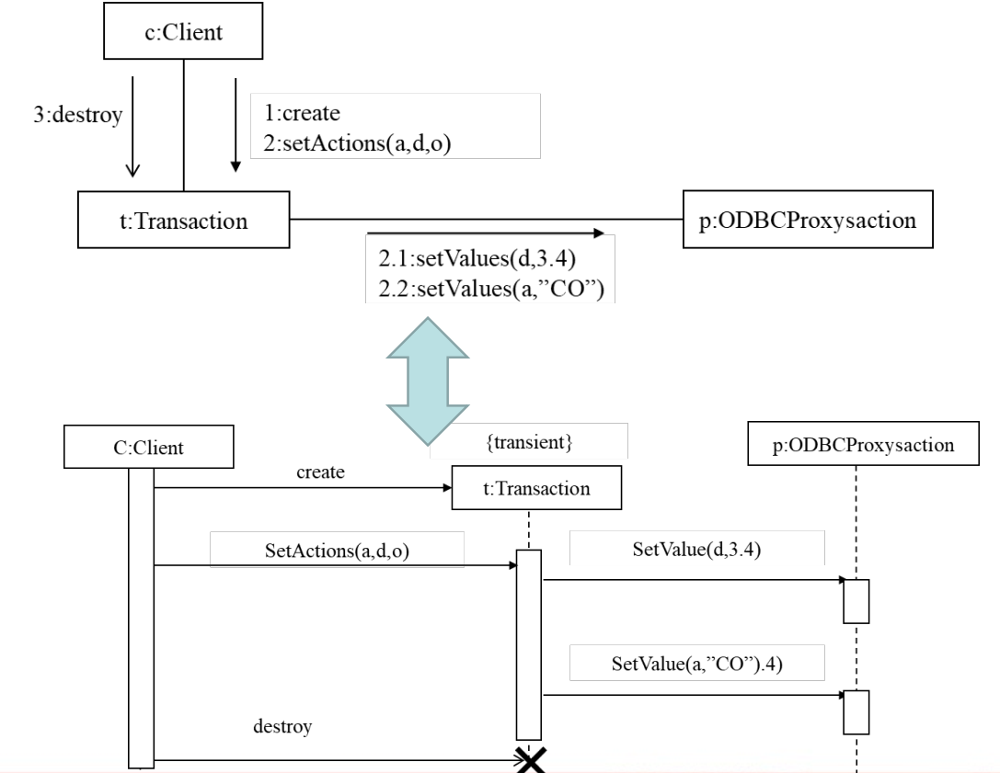

#### 交互概观图

用于描述系统的宏观行为，是活动图和顺序图的混合物。

#### 定时图

用于表示交互，它展现了消息跨越不同对象或角色的实际时间，而不仅仅关心消息的相对顺序。

## 第四章 OOA

运用面向对象方法，对问题域（被开发系统的应用领域）和系统责任（所开发系统应具备的职能）进行分析和理解  。

### OOA模型

### OOA过程

1. 发现对象，定义他们的类。
2. 识别对象的内部特征：定义属性、定义操作。
3. 识别对象的外部关系：分类关系（继承）、构成关系、静态联系、使用关系
4. 给出系统的相关顺序图、状态图和活动图等，以建立系统的动态模型
5. 划分包，建立系统的包图
6. 建立系统的详细说明

### 面向对象分析方法中的复杂度控制的机制

a） 信息组织的复杂性：

抽象:从许多事物中舍弃个别的、非本质的特征，抽取共同的、本质性 的特征：系统中的对象是对现实世界中事物的抽象； 类是对象的抽象；一般类是对特殊类的抽象； 属性是事物静态特征的抽象； 操作是事物动态特征的抽象。

分类机制:把具有相同属性和操作的对象划分为一类，用类作为这些对象 的抽象描述。

继承:特殊类的对象拥有其一般类的全部属性和服务（一般-特殊结构）；

聚合:把一个复杂的事物看成若干比较简单的事物的组装体，从而简化对 复杂事物的描述。（整体-部分结构）

消息通讯：要求对象之间只能通过消息进行通讯，而不允许在对象之外 直接地存取对象内部的属性。

多个视图：从多个角度认识系统

b） 文档组织的复杂性—控制机制

包：使模型具有大小不同的粒度层次，以利于控制复杂性

## 第五章 OOD

瀑布模型和喷泉模型

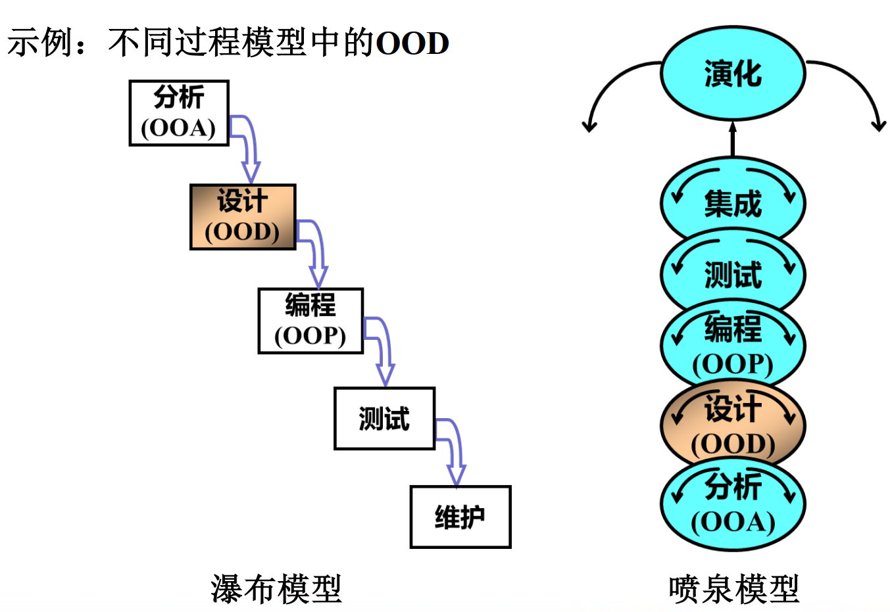

### OOD模型

### OOD过程

不强调次序，逐个设计每个部分。

#### 问题域部分

它是在OOA模型基础上按**实现条件**进行必要的修改、调整和细节补充而得到的。

实现条件：

1. 编程语言：对**问题域的影响最大**。选定的编程语言不支持某些面向对象的概念与原则；OOA阶段可能将某些与编程语言有关的对象细节推迟到OOD阶段来定义。如对象的创建、删除、复制、转存、初始化等系统行为、属性的数据类型等。  
   1. 为复用设计与编程的类而增加新的结构
   2. 增加一般类以建立共同协议（比如：提供创建、删除、复制等操作，Java里面的object就可以体现这个问题，它是所有的类的父类，所有的类都要继承它）`object{复用}`
   3. 按编程语言调整继承和多态：如果编程语言不支持多继承怎么办？（方法1：采用聚合，把多继承转换为单继承，方法2：重新定义对象类，方法3：压平）如果编程语言不支持继承怎么办？（方法1：把继承结构展平，所有需要的信息都放到展平后的类里面去；方法2：再加上聚合，每个类不存在信息冗余）如果编程语言不支持多态怎么办？重新命名函数。
   4. 提高性能：调整对象分布，合并通讯频繁的类
   5. 为实现对象永久存储做的修改
   6. 为编程方便增加底层成分
   7. 对复杂关联的转化并决定关联的实现方式：多对多关联转化为一对一关联
   8. 调整与完善属性
   9. 构造和优化算法
   10. 决定对象间的可访问性
   11. 定义对象实例：当系统需要通过从外存读取数据来创建一个对象时 ，先创建该对象，再从外存中读取这个对象数据，把数据赋值给对象的相应属性。
2. 硬件、操作系统及网络设施  
3. 复用支持
4. 数据管理系统
5. 界面支持系统

（道理：尽管继承和聚合反映了现实世界中两种不同的关系，但是从最终效果来看却存在共性－都是使一个类的对象能够拥有另一个（一些）类的属性和操作。）

（重新审视原来用多继承结构表达的实际事物及它们之间的关系。例如，上述例子换一个角度看问题：形成这种分类的原因使什么？从而增加“身份”类，构成单继承。）

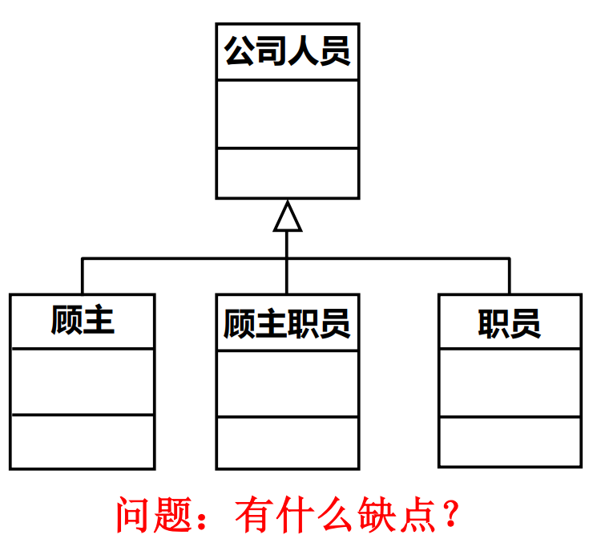

（缺点：损失了信息）

为什么要这么做：使反映问题域本质的总体框架和组织结构长期稳定，而细节可变；稳定部分与可变部分分开，使系统从容地适应变化；有利于同一个分析用于不同的设计与实现；支持系统族和相似系统的分析设计及编程结果复用；使一个成功的系统具有超出其生存期的可扩展性

#### 人机交互部分

OOD要设计人机交互的细节，而OOA用人机交互来反映需求

1. 分析与系统交互的人：设计时重点考虑比例最大的人员情况，并适当地兼顾其他人。
2. 从use case分析人机交互

人机交互界面的设计准则：使用简便、一致性、启发性、减少人脑记忆的负担、减少重复的输入、容错性、及时反馈、防止灾难性的错误

#### 控制驱动部分

控制流驱动部分，用于定义和表示并发系统中的每个控制流。用主动对象表示每个控制流(进程、线程)  ，所有的主动类构成控制驱动部分

如何设计控制驱动部分：用包括主动类的类图捕捉控制流的静态结构；用包括主动对象的顺序图或通信图捕捉控制流的动态行为。

#### 数据管理部分

数据管理部分是负责在特定的数据管理系统中存储和检索持久对象的组成部分

其目的是，存储问题域的持久对象、封装这些对象的查找和存储机制，以及为了隔离数据管理方案的影响

文件系统、R-DBMS（关系数据库系统）、OO-DBMS（面向对象数据库系统）

| 面向对象 | 实体-联系 | 关系数据库 |
| -------- | --------- | ---------- |
| 类       | 实体类型  | 表         |
| 对象     | 实体实例  | 行         |
| 属性     | 属性      | 列         |
| 关系     | 关系      | 表         |

这个关联的表是右下角，应该是一种 `link1 : {EmployeeNumber , Location}`这样的一行。

如果是1对多，可以为比如公司职员记录公司ID这个属性。或者是公司ID和职员ID建立一个关联表。

如果是多对多呢：

还有对父类和子类的关系的存储可以有下面的三种情况：

1. （下推）：为每一个子类定义一张单独的表。当增加新的父类或者子类的时候对数据库的维护和修改是很大的麻烦。
2. （上拉）去掉继承的网络结构。对实例要存储大量的冗余。
3. （分割表）将父类和子类的状态存储在不同的表中。这种方法很好地反映了继承网格，但它的缺点是访问数据时需要许多跨表连接。

对象存储器。

#### 构建及部署部分

构件具有端口和接口。

接口是一个圆圆的或者半圆的，端口是一个方形的那个。

## 第六章OOP&OOPL

### OOPL的基本特性

语言元素可以支持

1. 类的定义
2. 对象的静态声明或者动态创建
3. 属性和操作的定义
4. 继承、聚合、关联和消息的表示

语言机制有：

1. 类机制
2. 封装机制
3. 继承机制

高级特性：多态、多继承的表示和支持机制

### 纯面向对象语言和混合型面向对象语言的各自特点

纯面向对象语言：Smalltalk、Eiffel、Java

较为全面的支持OO，强调严格的封装

混合型：C++、Objective-C、Objective-Pascal、Python

在一种非OO语言的基础上扩充OO成分、对封装采取灵活的态度

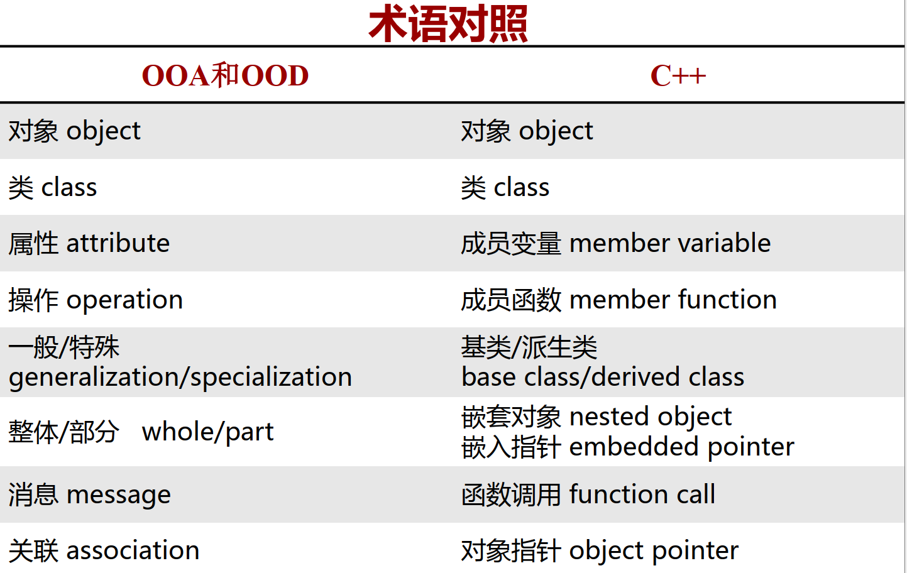

问：为什么说对象指针实现了关联?

## 第七章 设计模式

### 外观模式

在高层定义接口，隐藏复杂性。可以理解为UI界面。

或者类似于一个APP的页面。

1. 隐藏复杂性
2. 可以用来包装遗产系统
3. 用来检测某项的访问量

### 桥接模式

将抽象部分与它的实现部分分离，使它们都可以独立地变化

识别出一个类所具有的两个独立变化的维度，将它们设计为两个继承等级结构，并建立抽象和实现的聚合关系

### 单例模式

一个类只有一个实例，并提供全局的访问点。

全局变量无法阻止多次的实例化，而单例把实例化的方法私有了，这样就只能在一开始创建的时候实例化一次了。

先判断单例是否已经实例化，没有实例化的话再对实例化函数加锁。

### 备忘录模式

类似于一个存档。

### 策略模式

优势：低耦合！策略可以自由切换，系统扩展性、灵活性更高 

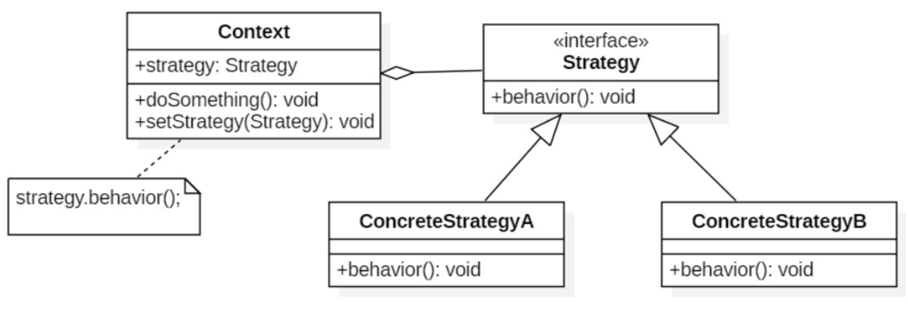

### 工厂方法模式

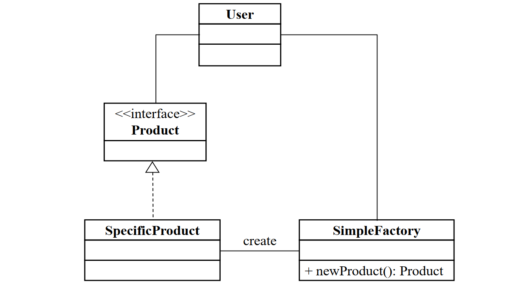

让所有的实例化都通过工厂来完成。

可以减少构造对象的时候的复杂性。

### 抽象工厂模式

用来创建对象族的。

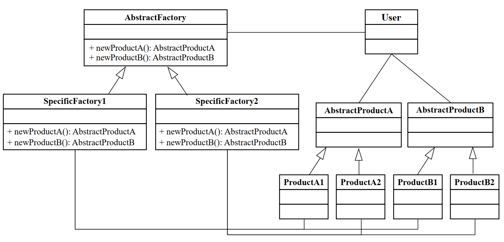

### 代理模式

代理还可以再加入一点自己的操作。

### 迭代器模式

提供访问数据结构的方法

### 访问者模式

访问复杂的数据结构

### 观察者模式（发布-订阅模式）

### 命令模式

将一个请求封装成一个对象，使得发出请求的责任和执行请求的责任分开。

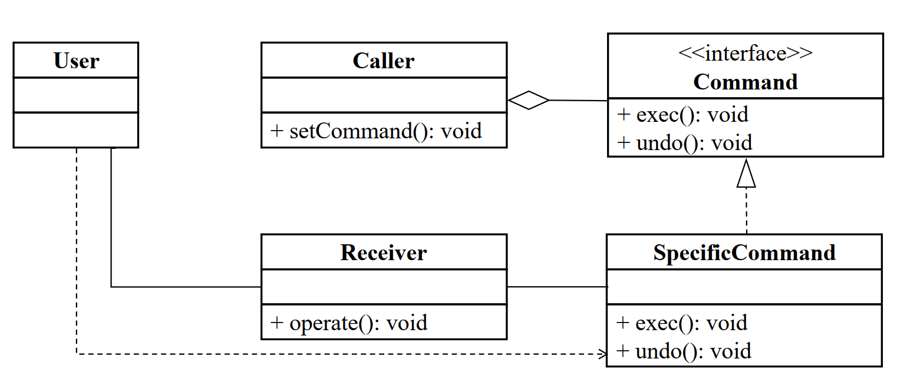

命令模式降低了耦合，命令的使用者不再需要了解系统底层的逻辑，只需要使用包装好的命令。

### 模板模式

定义一个算法的骨架，把一些操作延迟到子类中进行。

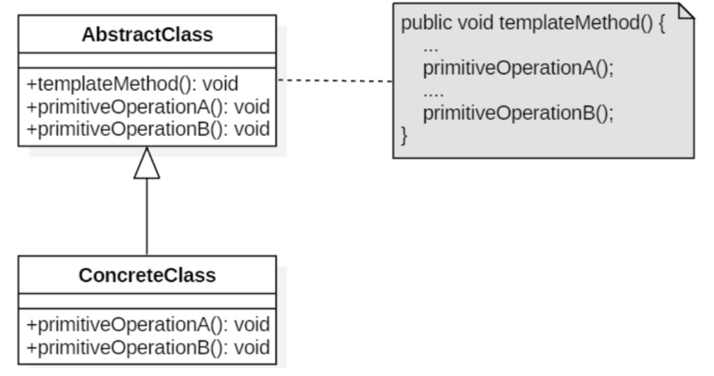

### 空对象

一个方法返回 NULL，意味着方法的调用端需要去检查返回值是否是 NULL，这么做会导致非常多的冗余的检查代码。并且如果某一个调用端忘记了做这个检查返回值，而直接使用返回的对象，那么就有可能抛出空指针异常。

### Mixin模式

还不太理解

### 适配器模式

定义一个转换器，将一个类的接口转换成用户需要的另一个接口

比如要修改数据格式。

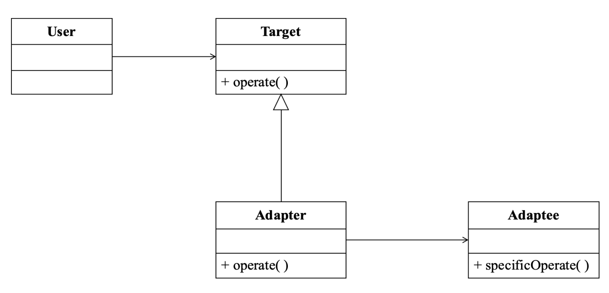

### 依赖注入

对象声明自己的依赖，而该依赖由外部注入的形式为其提供

可以降低耦合度（如果自己里面再声明一个类，耦合度太高了）

## 第八章 代码风格和编码规范

防御式编程 ：数组越界、空指针、函数参数、返回值、外部接口。

考虑到输入的不确定性，在程序代码的主要逻辑之外增加了大量的检查，包括对所有外来数据的检查、对所有输入参数的检查等，并最终决定如何处理不符合预期的输入。

理解构成良好代码风格的主要因素：

1. 命名—符合语义（是什么、做什么、易于识别）

2. 注释—合理使用序言式注释与功能性注释

3. 视觉组织—清晰的缩进、空格与换行

4. 语句构造—避免太长的子程序、嵌套、语句，避免一行多语句

5. 输入输出—检查输入输出、简化输入输出步骤、合理的输入输出提示、为输出添加注释

6. 避免“魔法”—何为魔法串/数字

## 第九章 面向对象测试

### 软件测试的步骤

1. 单元测试：集中于每个独立的模块。该测试以详细设计文档为指导，测试模块内的重要控制路径。（往往采用白盒测试技术）
2. 集成测试：集中于模块的组装。其目标是发现与接口有关的错误，将经过单元测试的模块构成一个满足设计要求的软件结构。
3. 确认测试（有效性测试）：目标是发现软件实现的功能与需求规格说明书不一致的错误。（通常采用黑盒测试技术）
4. 系统测试：集中检验系统所有元素（包括硬件、软件）之间协作是否合适，整个系统的性能、功能是否达到。

#### 单元测试

1. 主要依据详细设计说明书和源代码清单

2. 主要测试模块的I/O条件和模块的逻辑结构

3. 主要采用白盒测试方法设计测试用例，辅以黑盒测试的测试用例，使之对任何合理的和不合理的输入都要鉴别和响应

4. 要对所有的局部和全局数据结构、外部接口和程序代码的关键部分进行代码审查

#### 集成测试

1. 把各个模块连接起来的时候，穿越模块接口的数据是否丢失  
2. 一个模块的功能是否对另一个模块的功能产生不利的影响  
3. 各个子功能组合起来，能否达到预期要求的父功能  
4. 全局数据结构是否有问题  
5. 单个模块的误差累加起来，是否达到不可接受的程度  

集成测试的方法：一次性组装方法、增量式组装方法

#### 确认测试

有效性测试，即验证软件的功能和性能及其他特性是否与用户的要求一致

有效性测试是在模拟的环境（可能是开发环境）下，运用黑盒测试的方法，验证被测软件是否满足需求规格说明书列出的需求。  

软件配置审查是保证软件配置的所有成分齐全，各方面的质量符合要求，具有维护阶段所必须的细节，并且已编排好分类的目录。  

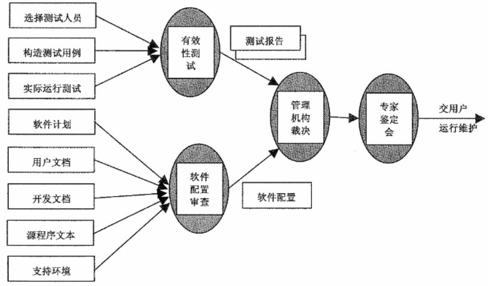

#### 系统测试

集中检验系统所有元素（包括硬件、信息等）之间协作是否合适，整个系统的性能、功能是否达到。

系统测试实际上是一系列不同的测试，以下是用于系统测试的几种典型软件系统测试：

1. **功能测试**：在规定的时间内运行软件系统的所有功能，以验证这个软件系统有无严重错误。
2. **恢复测试**：是一种系统测试，它指采取各种人工干预方式强制性地使软件出错，使其不能正常工作，进而检验系统的恢复能力
3. **安全性测试**：就是试图去验证建立在系统内的预防机制，以防止来自非正常的侵入
4. **强度测试**：是在非正常数量、频率或容量资源方式下运行一个系统  （已经不正常了）
5. 压力测试：系统正常运行的最低限度
6. **性能测试**：测试软件在被组装进系统的环境下运行时的性能  （还是正常的）
7. **可用性测试**：从使用的合理性、方便性等角度对软件系统进行检验，以发现人为因素或使用上的问题
8. **部署测试（配置测试）**：软件必须在多种平台及操作系统环境中运行。有时将部署测试称为配置测试，是在软件将要在其中运行的每一种环境中测试软件。另外，部署测试检查客户将要使用的所有安装程序及专业安装软件，并检查用于向最终用户介绍软件的所有文档。

### 面向对象的测试策略

#### 面向对象单元测试

也就是**类测试**。面向对象软件的类测试相当于传统软件中的单元测试，**类包含的操作是最小的可测试单元**

功能性测试：以类的规格说明为基础，主要检查类是否符合规格说明的要求。功能性测试包括两个层次：**类的规格说明和方法的规格说明**  

结构性测试：从程序出发，对类中的方法进行测试，需要考虑其中的代码是否正确。测试分为两层  ：第一层考虑类中各独立的方法，即方法要做单独测试；第二层考虑方法之间的相互作用，即方法需要进行综合测试

基于状态的测试：基于状态的测试是通过检查对象的状态在执行某个方法后是否会转移到预期状态的一种测试技术；跟踪监视对象数据成员的值的变化。

#### 面向对象集成测试

基于线程的测试（thread-based testing）：对响应系统的一个输入或一组类进行集成，每个线程单独地集成和测试事件所需的，应用回归测试以确保没有产生副作用

基于使用的测试(use-based testing)：通过测试很少使用服务类的那些类（称之为独立类）开始构造系统，独立类测试完后，利用独立类测试下一层次的类（称之为依赖类）。继续依赖类的测试直到完成整个系统

簇测试（cluster testing）是面向对象软件集成测试中的一步  ：利用试图发现协作中的错误的测试用例来测试协作的类簇  

#### 面向对象系统测试

功能测试、强度测试、性能测试、安全测试、回复测试、可用性测试、安装/卸载测试

### 面向对象软件的测试模型

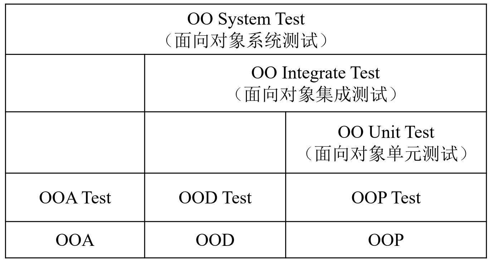

#### OOA Test

对认定的**对象**的测试：

1. 测试认定的对象是否全面，是否问题空间中所有涉及的实例都反映在认定的抽象对象中  
2. 测试认定的对象是否具有多个属性，**只有一个属性的对象通常应看成其他对象的属性，而不是抽象为独立的对象**  
3. 测试被认定为同一对象的实例是否具有**区别于**其他实例的共同属性  
4. 测试被认定为同一对象的实例是否提供或者需要相同的服务。**如果服务随着不同的实例而变化，那么认定的对象就需要进行分解或者继承来分类表示**  
5. 认定的对象的名称应该尽量准确、适用

结构分为两类：分类结构（一般-特殊）和组装结构（整体-部分）

对认定的**分类结构**的测试。

对认定的**组装结构**的测试。

对定义的属性和实例关联的测试  

对定义的服务和消息关联的测试  

#### OOD Test

对认定的类的测试  

对构造的类层次结构的测试  

对类库支持的测试  

#### OOP Test

数据成员是否满足数据封装的要求  

类是否实现了要求的功能  

